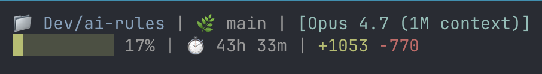

# ai-rules

Plan-driven engineering workflow for Claude Code, packaged as a plugin (`flow`): plan → implement → review → ship.

Each skill is a self-contained procedure under `skills/<name>/SKILL.md`. Some skills (like `review-pr`) fan out to specialized agents in `agents/<name>.md` that run in parallel. The plugin also bundles a hook that injects worktree guidance into `/flow:implement`.

## Install

Clone this repo, then inside any Claude Code session register it as a local marketplace and install the plugin:

```
/plugin marketplace add /path/to/ai-rules
/plugin install flow
/reload-plugins
```

After installing, all skills are namespaced under `/flow:` — e.g. `/flow:plan-review`, `/flow:self-review`. Run `/flow` in the slash menu to see the full list.

## The standard flow

```
draft plan in plan mode
        │
        ▼
   /flow:plan-review     →  saves plan to .claude/plans/<name>.md
        │
        ▼
      /clear             (fresh context — recommended)
        │
        ▼
/flow:implement <plan>   →  pre-flight, branch, step-by-step commits
        │
        ▼
   /flow:ship-loop       (auto-invoked by /flow:implement)
        │
        ├─ /flow:self-review
        ├─ /flow:pr               →  opens draft PR
        └─ /flow:review-loop      →  iterates until clean, then handles CI
```

## Commands

| Command                            | Model  | What it does                                                                 |
| ---------------------------------- | ------ | ---------------------------------------------------------------------------- |
| `/flow:plan-review`                | opus   | Critiques and refines a plan, saves it to `.claude/plans/`                   |
| `/flow:implement <plan>`           | sonnet | Pre-flight, branches, executes the plan with one commit per step             |
| `/flow:ship-loop`                  | sonnet | Orchestrator: `/flow:self-review` → `/flow:pr` → `/flow:review-loop`         |
| `/flow:self-review`                | sonnet | Strict pre-commit review of the current diff (lint, hygiene, correctness)    |
| `/flow:pr`                         | sonnet | Opens a draft PR; pulls Linear + Figma context; Conventional Commits title   |
| `/flow:review-loop`                | sonnet | Up to 5 iterations of fresh-context review and fix, then handles CI          |
| `/flow:review-pr`                  | opus   | Deep PR reviewer invoked by `/flow:review-loop` via fresh context            |

## Loops at a glance

| Loop          | Where                       | Cap          | Purpose                              |
| ------------- | --------------------------- | ------------ | ------------------------------------ |
| Self-critique | inside `/flow:plan-review`  | 3 iterations | tighten the plan before saving       |
| Review / fix  | inside `/flow:review-loop`  | 5 iterations | drive blocking issues to zero        |
| CI fix        | inside `/flow:review-loop`  | 2 attempts   | bounded retry for green CI           |

## Status line

`scripts/statusline.sh` is a two-line Claude Code status line: project + branch + model on top, context-usage bar + elapsed session time + lines added/removed (only when non-zero) underneath.



The status line is **not** part of the plugin — Claude Code's plugin `settings.json` doesn't accept a `statusLine` key. Wire it up manually instead:

```bash
ln -s "$(pwd)/scripts/statusline.sh" ~/.claude/statusline-command.sh
```

```json
"statusLine": {
  "type": "command",
  "command": "bash ~/.claude/statusline-command.sh"
}
```

## Conventions

- Plans live in `.claude/plans/<name>.md` at the repo root.
- Branch names come from the Linear ticket's suggested `branchName` when a ticket is referenced.
- Fresh context (`claude --print`) is used for plan and PR reviews to avoid echo-chamber bias.
- Conventional Commits for PR titles; no ticket IDs in title or body.
